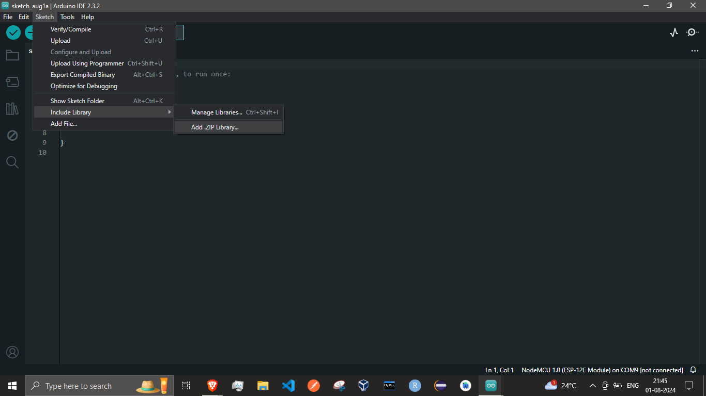

# Cryptographic WiFi Module Library

An Anrduino Library for interfacing CryptoWiFi Module.
Upload Firmware on any ESP8266 family board -> Include CryptoWiFiClient in Arduino IDE
And you are good to go!
## Getting Started

Download this repository on your machine.

#### Add the zip file through Library Manager

- In Arduino IDE got to Sketch/Include Library.
- Click on **Add .zip Library**.
  
- Start using it.

#### Clone the repository
```bash
git clone https://github.com/yourusername/Cryptographic-WiFi-Module-Library.git
```

## Include Library

In your Arduino sketch, include the `CryptoWifiClient.h` header file.
```cpp
#include <CryptoWifiClient.h>
```

## Initialization
Initialize the library in your setup function.
```cpp
CryptoWifiClient wifiClient(rxPin, txPin);
wifiClient.initialize();
```


## Usage

Utilize the library's functions for various tasks such as sending WiFi credentials, setting server details, and performing `HTTP` requests.

**Sending WiFi Credentials**  
Use this function to sconnect your device and the `ESP8266` Module.

```cpp
// Example: Sending WiFi credentials
wifiClient.sendWiFiCredentials("SSID", "password");
```

**Setting server details**  
Set the details of the server you are using, along with the protocol to be used to send the data. 

```cpp
// Example: Setting server details
wifiClient.setServerDetails("example.com", HTTPS);
```

**Getting server name and protocol**  
This is a utility getter function to improve the encapsulation over internal data.

```cpp
// Example: Getting server name and protocol
String server = wifiClient.getServerName();
String protocol = wifiClient.getProtocol();
```

**Sending HTTP GET request**  
Send a `GET` request to your web server.

```cpp
// Example: Sending HTTP GET request
wifiClient.getQuery("endpoint", "encrypted_params");
```

**Sending HTTP POST request with URL encoded parameters**  
Send a `POST` request to your web server.

```cpp
// Example: Sending HTTP POST request with URL encoded parameters
wifiClient.postQuery("data", "encrypted_data");
```

**Sending HTTP POST request with JSON data**  
This function allows the users to send JSON data to the web server.

```cpp
// Example: Sending HTTP POST request with JSON data
wifiClient.postJSON("{\"key\":\"value\"}");
```

**Generating encryption key**  
Randomly generate the encryption key.

```cpp
// Example: Generating encryption key
const char* key = wifiClient.generateKey(16);
wifiClient.setKey(key);
```

## Connecting Arduino and NodeMCU for Serial Communication

To connect your Arduino to the NodeMCU for serial communication, follow these steps:

### Hardware Connections

- **Arduino RX** --> **NodeMCU TX** (GPIO1)
- **Arduino TX** --> **NodeMCU RX** (GPIO3)
- **Arduino GND** --> **NodeMCU GND**
- **Arduino 3.3V** --> **NodeMCU 3.3V**

Make sure to connect the grounds of both boards together to ensure a common reference.

## System Architecture

- We have provided a reference **System Architecture** for you to get an idea how can this library be used.
  

## Instructions for contributing to the project
  - Create an issue or look for an existing issue.
  - Fork the repository to your github account using the **Fork** button at top right corner.
  - Clone the forked repository to your local android studio setup.
    ```bash
    git clone https://github.com/Your-Username/Your-Repository.git
  - Make your changes and commit them.
    ```bash
    git add .
    git commit -m "Your commit message"
    git push origin main
  - Create a Pull request.
  - Thank you for contributing!!.
